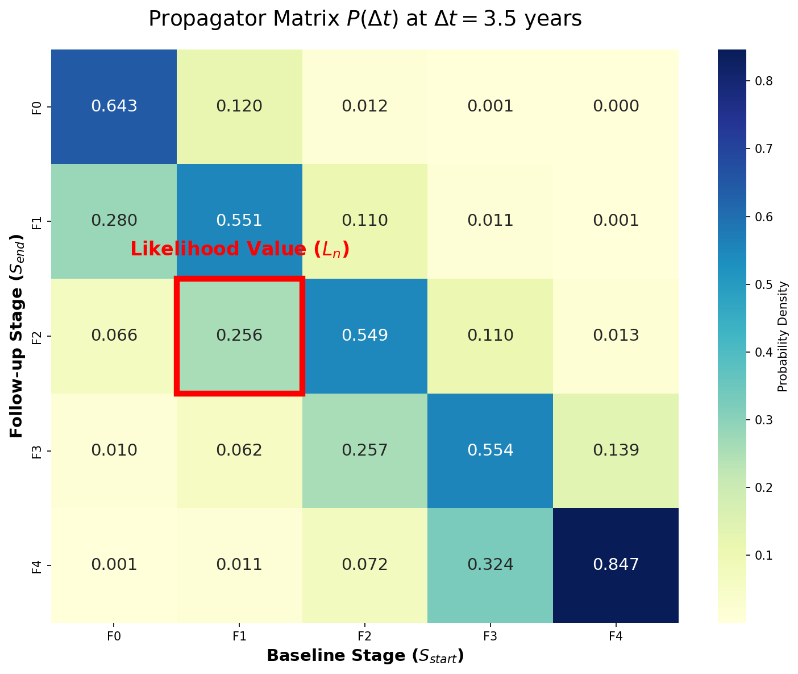
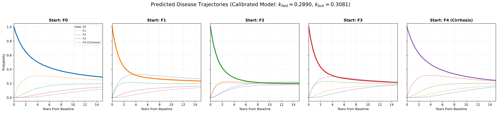
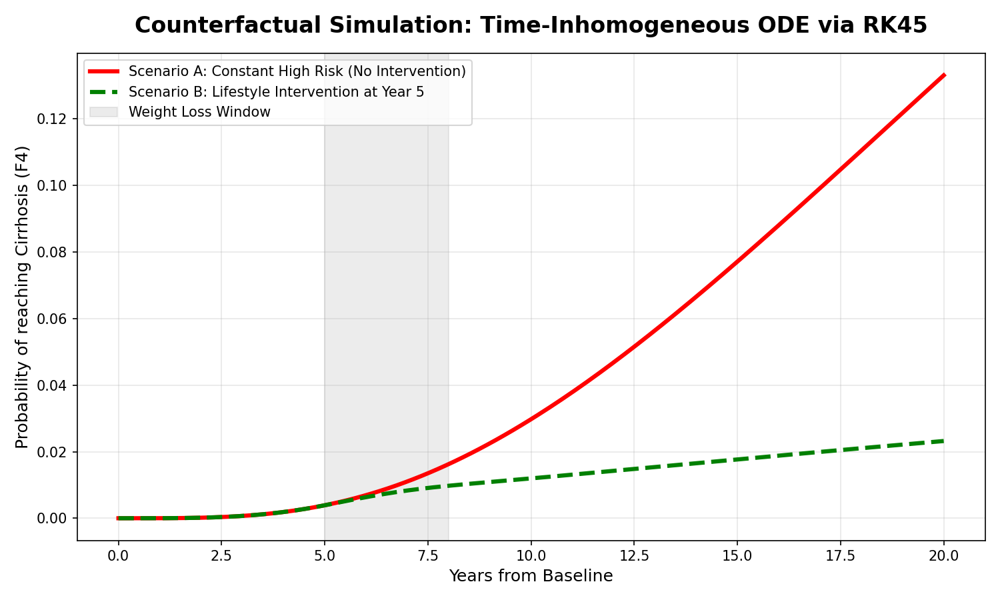

# Continuous-Time Markov-ODE Engine for Disease Dynamics

This repository contains the mathematical infrastructure I developed during my research at the **University of Sydney (School of Mathematics and Statistics)**. 

The project models the progression of metabolic liver disease using a deterministic compartmental framework. Rather than utilizing pure black-box machine learning, this engine emphasizes **physical interpretability, mass conservation, and rigorous statistical model selection**.

## Architecture & Modules

### 1. The Analytical Propagator (`expm`)
For time-homogeneous systems, numerical integration (e.g., Euler, RK4) introduces unnecessary stepping errors. Module 1 utilizes the **Matrix Exponential** to obtain exact analytical solutions ( $F(t) = e^{Qt}F(0)$ ), dramatically increasing computational efficiency during likelihood optimization.

### 2. Information Criteria & Calibration (AIC/BIC)
Calibrating complex matrices on sparse, interval-censored longitudinal data carries a high risk of overfitting. Module 2 implements a Maximum Likelihood Estimation (MLE) pipeline that actively penalizes model complexity using **Bayesian Information Criterion (BIC)**, ensuring the selected parameters generalize robustly.

### 3. Time-Inhomogeneous Dynamics (`RK45`)
When introducing time-varying covariates (e.g., dynamic weight trajectories), the generator matrix becomes a function of time $\mathbf{Q}(t)$. Because matrices at different time steps do not commute ($[\mathbf{Q}(t_1), \mathbf{Q}(t_2)] \neq 0$), the analytical solution breaks down. Module 3 solves this by dynamically rebuilding the rate matrix and integrating the non-autonomous system using **Runge-Kutta 4(5)**, allowing for counterfactual simulations of lifestyle interventions.

## Visualizing the Engine

### 1. The Likelihood Extractor (Time-Homogeneous)
By evaluating $\exp(Q\Delta t)$, we generate the exact probability landscape for irregularly sampled data, guaranteeing zero numerical drift during the MLE optimization.

### 2. Population Flux Dynamics
Using BIC-validated parameters, the system predicts the conditional long-term trajectories of patients, revealing intermediate stages as highly volatile pivot points.

### 3. Counterfactual Simulation (Time-Inhomogeneous)
For dynamic covariates where $[Q(t_1), Q(t_2)] \neq 0$, the RK45 numerical integrator allows us to simulate A/B testing scenarios, such as the delayed benefits of lifestyle interventions.

