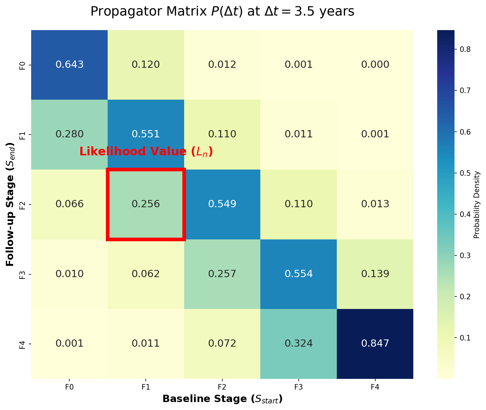
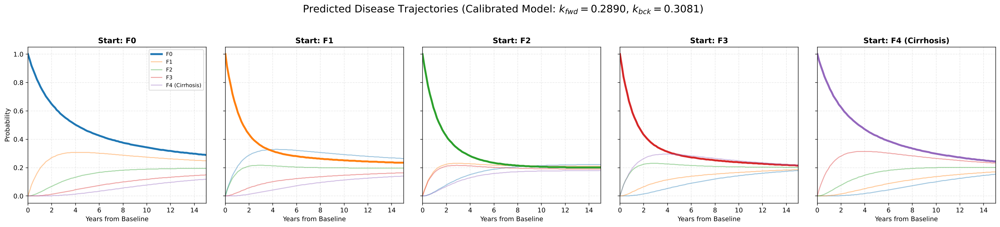
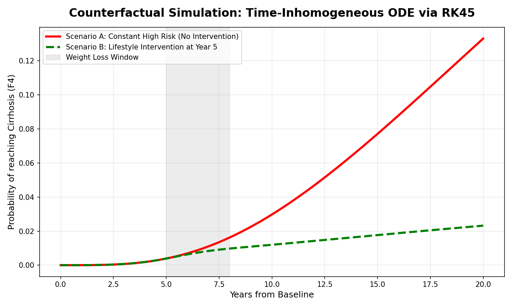

# Continuous-Time Markov–ODE Models for Liver Disease Dynamics

This repository contains the Python implementation of continuous-time compartmental models developed during a formal research project at the **University of Sydney School of Mathematics and Statistics**. The project studies metabolic liver disease progression using confidential longitudinal clinical data provided through **Royal Prince Alfred Hospital**.

The fitted results and figures shown below were obtained from the clinical study. Patient-level records are subject to confidentiality requirements and cannot be released publicly.

The modelling framework combines interpretable disease-state transitions, mass-conserving dynamics, likelihood-based calibration and time-varying numerical integration.

## Core components

### Matrix-exponential propagator

For a time-homogeneous generator matrix $Q$, the transition operator is

$$
P(\Delta t)=\exp(Q\Delta t).
$$

`AnalyticalFluxEngine` constructs a nearest-neighbour, mass-conserving generator and evaluates this operator with `scipy.linalg.expm`. This avoids introducing an additional time-stepping discretisation inside likelihood evaluation.

### Maximum-likelihood calibration and model selection

`ModelCalibrator` evaluates transition likelihoods from irregular longitudinal observations, estimates non-negative progression and regression rates, and computes Akaike and Bayesian information criteria for model comparison.

### Time-inhomogeneous dynamics

`DynamicFluxEngine` allows transition rates to depend on a time-varying covariate. When $Q(t)$ changes over time and generators at different times do not commute, the package integrates

$$
\frac{dF}{dt}=Q(t)F(t)
$$

with the adaptive RK45 method.

## Installation

```bash
git clone https://github.com/WuYefan77/Liver-Dynamics-Analysis.git
cd Liver-Dynamics-Analysis
python -m pip install -e .
```

## Python API

```python
from liver_dynamics import (
    AnalyticalFluxEngine,
    DynamicFluxEngine,
    ModelCalibrator,
)

# Time-homogeneous transition operator using fitted rates.
engine = AnalyticalFluxEngine(n_states=5)
Q = engine.build_generator_matrix(
    k_fwd=fitted_rates["forward"],
    k_bck=fitted_rates["backward"],
)
P = engine.transition_matrix(Q, dt=follow_up_interval)

# Likelihood calibration from an authorised clinical transition table.
calibrator = ModelCalibrator(clinical_transitions, n_states=5)
fit = calibrator.fit(initial_params=(0.1, 0.1))
aic, bic = calibrator.calculate_ic(
    nll=fit.fun,
    k=len(fit.x),
    n=len(clinical_transitions),
)
```

The expected calibration columns are `start_stage`, `end_stage` and `dt`. The package uses the column-vector convention $dF/dt=QF$, so generator columns sum to zero and $P_{ij}$ is the probability of ending in state $i$ from starting state $j$.

## Results

### Transition likelihoods

The matrix-exponential propagator maps an observed baseline stage and follow-up interval to the corresponding transition likelihood.



### Fitted disease trajectories

Parameters calibrated on the confidential clinical cohort produce conditional disease-state probability trajectories across follow-up time.



### Time-varying covariate simulation

The time-inhomogeneous solver supports model-based counterfactual simulations under dynamic covariate trajectories.



## Research context

This work was conducted at the University of Sydney under the supervision of **Professor Peter Kim** and **Dr Joachim Worthington**, using confidential clinical data provided through Royal Prince Alfred Hospital.

## License

The source code is released under the [MIT License](LICENSE). The clinical dataset is not covered by this repository or its software license.
